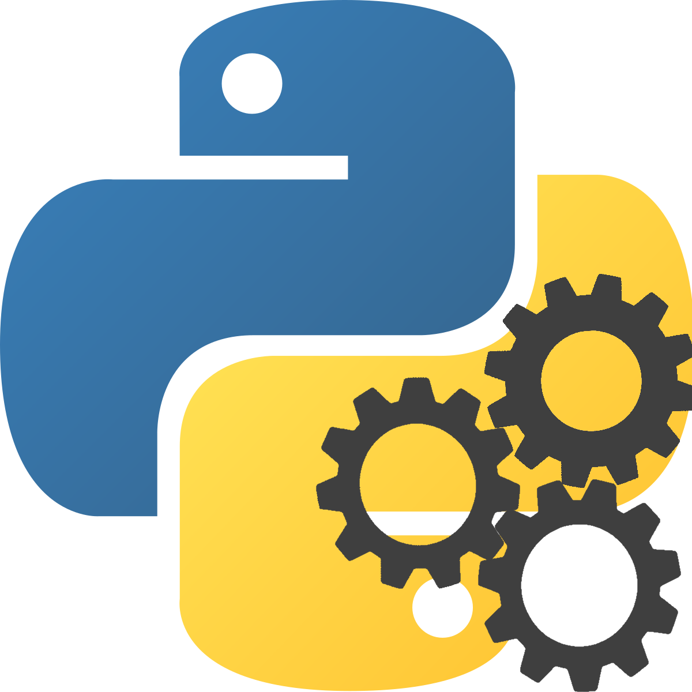

# The Bot Library

<p align="center">
  

The Bot Library is a python program which enables you to 'bot' things, i.e. let a robot do it for you.

#### Current features:

- KahootBot
  - Flood Bots
  - Answer Bot

- Interactive Console


## Requirements  - !!! IMPORTANT !!!

Firstly, you will need chromedriver which can be found [here](https://chromedriver.chromium.org/)

Then you will need to add it to path

## Python Libraries

Using the package manager [pip](https://pip.pypa.io/en/stable/) you will need to install the following

The program **will not run** without these libraries

> ### [Selenium](https://pypi.org/project/selenium/)
> This is used to control and interact with the browser
>```bash
>pip install selenium
>```

> ### [KahootPY](https://pypi.org/project/KahootPY/)
>This is used to interact with Kahoot! which is used in the KahootBot() class
>```bash
>pip install KahootPY
>```

> ### [Colorama](https://pypi.org/project/colorama/)
>This spices up the look of the program a little by adding colours
>```bash
>pip install colorama
>```

## Usage

Upon running the program you will be greeted with a welcome message, which states "Type 'help' to get started"

The 'help' command will display a help menu, though the command you're probably interested in is 'execute'. This how you access the program and start up the bot of your choice.

### Command: 
```bash
execute <process{arguments}>
```
### Example:
```bash
execute KahootBot(1234567, "BotName", "QuizName")
```

Using 'help execute' which will then ask you if you want to list the all processes and their PID (Process ID)

#### You can execute a program using it's PID like this:
```bash
execute pid:1
```

## Notice

 Kahoot! and the K! logo are trademarks of Kahoot! AS and I do not own them
